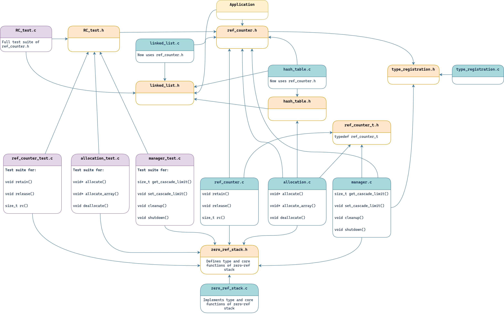

# Design Report

## The ref_counter_t Type
Reference counting can be described as simply keeping count of the number of references to an object. We do this by deferring any direct memory allocation for an object (using `malloc` or `calloc`) to an allocation function, which puts a little counter right before the object in memory. In addition to a counter, we also need several additional pieces of metadata. So we really need a little struct before the object. We define it as such:
*ref_counter.h*
```c++
typedef struct ref_counter {
	uint8_t count; // Maximum count: 256
	void *data;
	function1_t destructor;
	char *type;
} ref_counter_t;
```
The properties are defined as such:
- `count`, which is the counter itself. 
- `*data`, which is the pointer to the start of the memory the user requested, appearing directly after the struct in memory.
- `destructor`, which is a function pointer to an optional destructor function.
- `type`, which is a string representing the type of the object. This can be used instead of a specific destructor pointer, for type-based destruction.

When we previously would `malloc` or `calloc`, we now use a function defined in ref_count.h `allocate()` or `allocate_array()`. These functions return a void pointer, meaning it is generic, and will be interpreted as whatever the user needs it to be, depending on the context. The end user will never need to know about the ref_counter struct that sits atop of the object. 
## System Architecture

We decided on three subdivisions of ref_counter.h based on a separation of concerns. The reasoning went:
- `allocate`, `allocate_array` and `deallocate` all manage the actual memory allocation and deallocation, and were therefore bundled together in a file named `allocation.c`.
- `retain`, `release`, and `rc` all manage the "count" value of a ref_counter_t object, so they were defined in a file named `ref_counter.c`
- `cleanup`, `shutdown`, `get_cascade_limit` and `set_cascade_limit` do not fit into the other categories, and pertain to the overarching functionality of the reference counter, so these were put in a file called `manager.c`

After getting the fundamentals working, we needed to think about:
- A hash table containing the pointer offsets for various object types.
- A linked list containing any objects with zero references but that are yet to be deallocated.
## Type Registration and Allocation
By coupling a type name with a set of byte offsets, we can, given a pointer to a struct with a known type, free its allocated memory using the byte offsets. We need to store these (type : offsets) entries in a hash table, which we call the *type registry*.

In type_allocation.c, the three functions that are relevant for this logic can be found. In essence, we have:
- `create_registry()`, which when called, initializes the type registry hash table in a global variable. 
- `__register_type(char *type, int size, int num_offsets, int *offsets)`, which when called with the required arguments, creates a new entry in the global type registry, as long as that type does not already exist. If the type registry hash table has not been initialized, it calls `create_registry()` to initialize it.
- `__allocate_from_type(char* type)`, which when called with a known and registered type, returns a pointer to a section of memory with the size that was specified for the type, with a ref_counter_t struct right before it. 

These functions are not expected to be called by the end user. Instead, in ref_counter.h (which should be the only file the end user needs to import) we have macros defined:
- `register_type(type, ...)` which takes a direct type reference (that is, we give the name of type without quotation marks) and any number of arguments, which are names of the properties in the struct where freeable memory resides. The macro calls upon yet another macro found in type_registration.h, which, using convoluted macro logic, discerns the number of arguments, and automatically figures out their offsets in bytes. This is then used to create an entry in the type registry.
- `allocate_from_type(type)` which, as the name suggests, simply takes the name of a type, and returns a pointer to the reference counted and allocated memory. 
- `allocate_from_type_no_zr(type)` is a hacky workaround for an issue that we ran into fairly late in the project. Since not retaining an object that has been allocated before another allocation occurs immediately removes that first object (*see implementation of zero-ref stack below*), it was difficult to create a shopping cart that we didn't want to retain, because it was going to be added to be added to a linked list when it was fully initialized. The shopping cart had several properties that also needed to be allocated. In hindsight, there are a multitude of ways to solve this. We could have, for example, added the cart to the linked list before allocating its properties. We could also have retained it, added it to the linked list, and then released it. The stress of getting the project in on time definitely contributed to this function being defined, but perhaps it could be of some use to the end user in a highly specific situation. 
## Zero-ref Stack
We implemented a custom data structure to manage the collection of any objects with zero references. This was to prevent strange feedback loops with , and keeping the zero_ref_counter itself out of memory management. It is instead a stack-like structure that can push and pop onto it. The reasoning is that if you allocated an object, you are likely to immediately retain it, meaning it will be at the top of the stack, so you can quickly pop it (it's not a true stack, since items other than the top can be removed as well).

When an object is allocated, it is *immediately and automatically added to the zero_ref stack*, since it has no references yet. Additionally, `allocate()` and `allocate_array()` both clear the zero-ref list whenever they are called. When an object with zero references is `retain()`ed, it is removed from the zero-ref list. Therefore, it is *vital* that one retains an object they have just created, before trying to allocate another object. 

```c
// [BAD]
char* x = allocate(sizeof(char) * 10, NULL); // x is in the zero-ref list
char* y = allocate(sizeof(char) * 10, NULL); // y is the the list, x is now freed
retain(x); // Crash
retain(y);
puts(*x);

// [BETTER]
char* x = allocate(sizeof(char) * 10, NULL); // x is removed from zero-ref list
retain(x); // x is removed from zero-ref list
*x = 'f';
char* y = allocate(sizeof(char) * 10, NULL); // y is removed from zero-ref list
retain(y); // y is removed from zero-ref list
puts(*x); // Prints 'f'

``` 

**In some cases, for example, when adding an item to a linked list, you can expect the linked list to retain it. So calling retain() is not always necessary.**

ref_counter.h defines macros that execute functions defined in type_registration.h, and implemented in type_registration.c. We want to keep the number of files that an end user needs to import to an absolute minimum: ref_counter.h exclusively. We also don't want to clutter the ref_counter.h file, so this requires further modularization.

```c
typedef struct test2 {
    int* p1;
    int padding;
    float padding2;
    char* p2;
}test2_t;

register_type(test2_t, p1, p2); // Creates an entry in the type registry {"test2_t" : [0, 24]}
test2_t *temp = allocate_from_type(test2_t); // Allocates memory required for a test2_t and sets it type to test2_t
```

When we allocate from type, we save the offsets in a hash table, with a type name as its key. This also means that the ref_counter_t type needs an additional field, so that when it is deallocated, it has something to look up in the type registry, namely:

```c
#pragma pack(1) // Prevent padding, reducing size from 32 bits to 25
typedef struct ref_counter {
    uint8_t count; // 8-bit counter, only 1 byte instead of 8 byte
    void *data;
    function1_t destructor;
    char *type;
} ref_counter_t;
```

This brings our total header size to 25 bytes, with #pragma pack(1) removing the padding between the count and data fields. 
The k-value for the implementation is as follows:
```INI
[Worst case]
Size of ref_counter_t = 25 bytes
Worst case k (memory requested is 8 bytes) = (25 + 8) / 8 = 4.125 

[make demo_memtest]
Memory requested in allocations: 4370 Bytes
Memory actually allocated: 7070 bytes
k = 7070 / 4370 = 1.617

```
These values were acquired by running our demo-program and counting any bytes requested in the `allocation()` functions.
## Cascading frees
The last, more advanced part of the specification pertained to cascading frees. This required a working zero-ref system, and somewhat ties into types as well, so this was one of the last things we implemented.

When an object is deallocated, its constituent properties that are also heap-allocated need to be freed as well. These properties may in turn also have constituent properties that need to be freed.

It was no big feat to get this implemented in a basic sense. When an object is deallocated, simply call its destructor function or lookup the offsets in the type registry. The crux of the problem arose when we needed to be able to free linked lists or hash tables. There's a problem where an entry in a hash table may or may not need to be freed. We can't have a general solution, since it would try to free memory that is not allocated